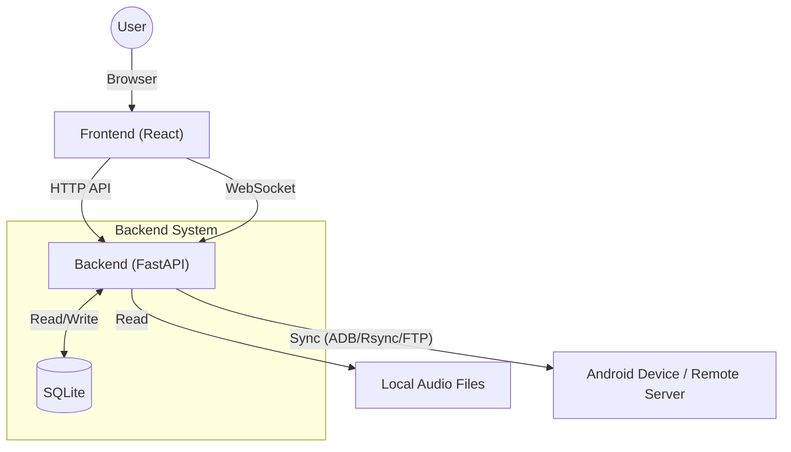

[English](./README.md) | 日本語

# Syncterra

Syncterraは、PC上の音楽ファイルをデバイスと同期するためのWebアプリケーションです。

## 主な機能

### 音楽ファイルの同期管理
PC上の指定したディレクトリの音楽ファイルのうち、選択した楽曲だけを同期することができます。

通常のファイルコピーや、robocopy/rsyncによる単純なディレクトリ同期では、”アルバムのうちいくつかの曲だけを同期する”といった操作は簡単には行えません。後から特定の曲を追加したり削除したりする場合はなおさら手間がかかります。

Syncterraでは、iTunesの同期方法を模して、ファイルごとに同期要否を設定できます。これにより、個別の楽曲の同期管理を容易に行うことができます。

### プレイリスト管理
Syncterra上でプレイリストの作成・編集が行えます。

### 同期方式
同期方式はADB, FTP, Rsyncから選択できます。
#### ADB
ADB (Android Debug Bridge)を使用してAndroid端末に楽曲ファイルを転送します。Syncterraが動作するマシンからADBコマンドでAndroid端末に接続できる環境が必要です。
> [!WARNING]
> ADB同期モードはテストが行われていないため、動作が不安定な可能性があります。

#### FTP
FTP (File Transfer Protocol)を使用して端末に楽曲ファイルを転送します。

被同期端末側でFTPサーバを起動してください。

Android端末であれば[Ftp Server](https://play.google.com/store/apps/details?id=com.theolivetree.ftpserver&hl=ja)などのアプリを使用してください。

#### Rsync
Rsyncを使用して端末に楽曲ファイルを転送します。

被同期端末側でRsyncをインストールしSSHサーバを起動してください。ただし同期先がローカルディレクトリの場合はSSHサーバは不要です。

Android端末であれば[Sshd4a](https://github.com/tfonteyn/Sshd4a)などのアプリを使用してください。

## スクリーンショット


## システムアーキテクチャ



Webベースのアーキテクチャとしています。

- **Frontend**: React (Vite) , AG Grid, etc
- **Backend**: Python + FastAPI
- **Data Management**: 設定、プレイリスト、楽曲管理情報はすべて SQLite に保存されます。
- **Core Engine**: `ADB`, `Rsync`, `FTP` の3つのプロトコルを抽象化した同期エンジン (`AudioSynchronizer`) を実装し、柔軟なデバイス環境に対応可能です。

## 前提条件

- **Runtime**:
    - Python 3.8+
    - Node.js (v18+ 推奨)
    - ADB (Android Debug Bridge) - ADB同期モードを使用する場合
- **Tools**:
    - [uv](https://github.com/astral-sh/uv) (Pythonパッケージ管理)
    - npm (Nodeパッケージ管理)


## 実行方法 （Docker 不使用）

### セットアップ

依存関係をインストールします。

#### Backend

```bash
uv sync
```

#### Frontend

```bash
cd frontend
npm install
```

### 起動

#### Backend

```bash
uv run uvicorn backend.main:app --reload
```

#### Frontend

別ターミナルで実行してください。

```bash
cd frontend
npm run dev
```

### アプリケーションへのアクセス

ブラウザで `http://localhost:5173` にアクセスしてください。
フロントエンドのプロキシ設定により、APIリクエストは自動的にバックエンドに転送されます。

## **(推奨)** Dockerでの実行

Docker Composeを使用して、セットアップ不要でアプリケーションを起動できます。
`docker-compose.sample.yml`をコピーして`docker-compose.yml`を作成してください。

#### 起動

```bash
docker-compose -f docker/docker-compose.yml up --build -d
```

#### アプリケーションへのアクセス

*   **Web UI**: `http://localhost:8280`
*   **API Docs**: `http://localhost:8280/api/docs`

#### 注意事項

*   **音楽フォルダ**: デフォルトではホストの `~/Music` が `/music/default` としてマウントされます。変更する場合は `docker/docker-compose.yml` の `volumes` セクションを編集してください。
*   **データベース**: `db/` ディレクトリに SQLite データベースが永続化されます。
*   **ADB同期**: Androidデバイスを同期する場合は、`docker-compose.yml` 内の `network_mode: "host"` を有効にする必要があります。

## 使用ソフトウェア

- **Backend**: Python, FastAPI, SQLAlchemy (SQLite), aiosqlite, Websockets
- **Frontend**: TypeScript, React, Vite, Mantine UI, AG Grid
- **Others**: Mutagen (Audio Metadata), Adbutils

## ライセンス

本ソフトウェアは **GPL v3 (GNU General Public License v3)** の下で公開されています。
詳細については [LICENSE](./LICENSE) ファイルを参照してください。
`mutagen` (GPL v2+) などのGPLライブラリを使用しているため、本ソフトウェアの派生物を布する場合はGPL互換ライセンスを採用する必要があります。
