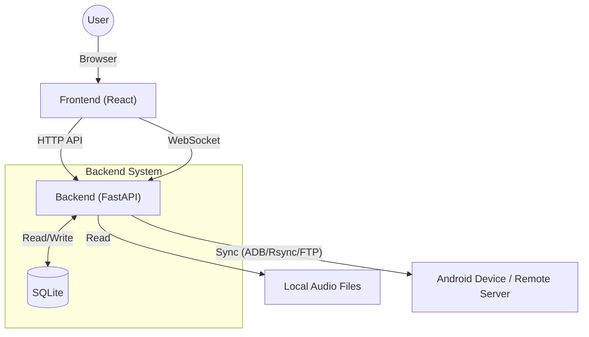

# AudioSync

AudioSyncは、PC上の音声ファイルをAndroidデバイスと同期し、プレイリストやメタデータを管理するためのWebアプリケーションです。

## 主な機能 (Features)

- **プレイリスト管理**: Web UI上で楽曲情報やプレイリストを一元管理。
- **Android同期**: ADB (Android Debug Bridge) または Rsync を用いた高速・セキュアな同期。
- **Web UI**: モダンなブラウザインターフェースで同期状況を確認・操作。
- **自動メタデータ取得**: Mutagenによるタグ解析機能。
- **リアルタイムログ**: WebSocketを通じた同期ログのリアルタイム表示。

## システムアーキテクチャ (System Architecture)



本システムは、モダンなWeb技術とPythonの強力なバックエンド処理を組み合わせたアーキテクチャを採用しています。

- **Frontend**: React (Vite) を採用し、高速でインタラクティブなUIを提供。AG Gridによる大量のデータ操作と、WebSocketを通じたリアルタイムな同期ログ表示を実現しています。
- **Backend**: FastAPI を使用し、非同期処理による高パフォーマンスなAPIを提供。
- **Data Management**: 設定、プレイリスト、楽曲管理情報はすべて SQLite に保存され、高速な検索と安定した動作を実現しています。
- **Core Engine**: `ADB`, `Rsync`, `FTP` の3つのプロトコルを抽象化した同期エンジン (`AudioSynchronizer`) を実装し、柔軟なデバイス環境に対応可能です。

## 前提条件 (Prerequisites)

- **Runtime**:
    - Python 3.8+
    - Node.js (v18+ 推奨)
    - ADB (Android Debug Bridge) - ADB同期モードを使用する場合
- **Tools**:
    - [uv](https://github.com/astral-sh/uv) (Pythonパッケージ管理)
    - npm (Nodeパッケージ管理)

## セットアップ (Installation & Setup)

### Backend

依存関係をインストールします。

```bash
uv sync
```

### Frontend

フロントエンドの依存関係をインストールします。

```bash
cd frontend
npm install
```

## 実行方法 (Usage)

開発サーバーを起動して使用します。

### 1. Backendの起動

```bash
uv run uvicorn backend.main:app --reload
```

### 2. Frontendの起動

別ターミナルで実行してください。

```bash
cd frontend
npm run dev
```

### 3. アプリケーションへのアクセス

ブラウザで `http://localhost:5173` にアクセスしてください。

## Dockerでの実行 (Usage with Docker)

Docker Composeを使用して、セットアップ不要でアプリケーションを起動できます。

### 1. 起動

```bash
docker-compose -f docker/docker-compose.yml up --build -d
```

### 2. アプリケーションへのアクセス

*   **Web UI**: `http://localhost:8280`
*   **API Docs**: `http://localhost:8000/docs`

### 3. 注意事項

*   **音楽フォルダ**: デフォルトではホストの `~/Music` が `/music` としてマウントされ、自動的にスキャン対象となります。変更する場合は `docker/docker-compose.yml` の `volumes` セクションを編集してください。
*   **データベース**: `db/` ディレクトリに SQLite データベースが永続化されます。
*   **ADB同期**: Androidデバイスを同期する場合は、`docker-compose.yml` 内の `network_mode: "host"` を有効にする必要があります。

## 技術スタック (Tech Stack)

- **Backend**: Python, FastAPI, SQLAlchemy (SQLite), aiosqlite, Websockets
- **Frontend**: TypeScript, React, Vite, Mantine UI, AG Grid
- **Others**: Mutagen (Audio Metadata), Adbutils

## ライセンス (License)

本ソフトウェアは **GPL v3 (GNU General Public License v3)** の下で公開されています。
詳細については [LICENSE](./LICENSE) ファイルを参照してください。
`mutagen` (GPL v2+) などのGPLライブラリを使用しているため、本ソフトウェアの派生物を配布する場合はGPL互換ライセンスを採用する必要があります。
