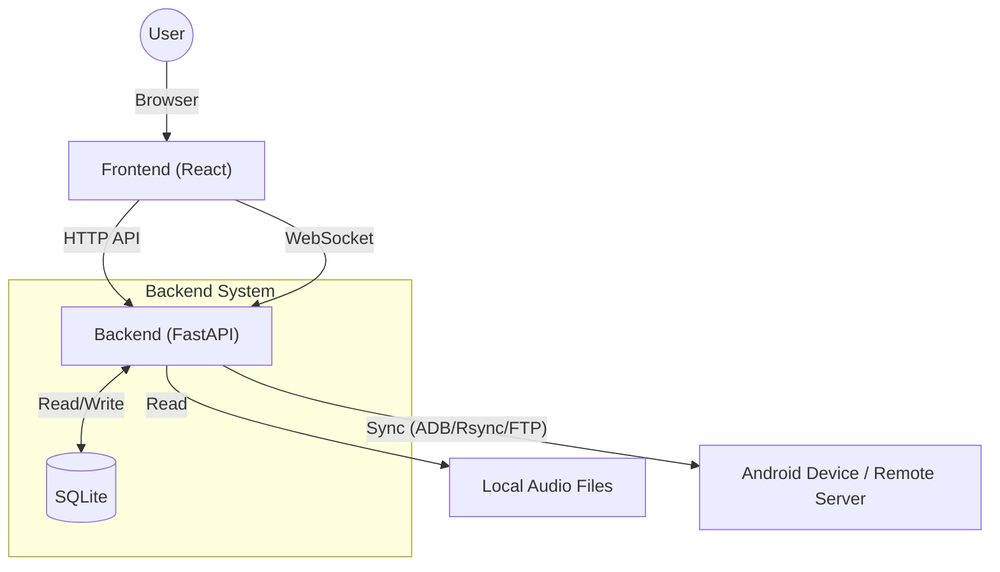

English | [日本語](./README.jp.md)

# Syncterra

Syncterra is a web application designed to synchronize audio files from your PC to your devices.

## Screenshots


## Key Features

### Audio File List
View a list of audio files on your PC, select files for synchronization, and check metadata.

### Playlist Management
Centrally manage track information and playlists on the Web UI.

### Settings Screen
Flexibly configure synchronization methods (ADB, FTP, Rsync), directory settings, exclusion settings, and more.
> [!WARNING]
> The ADB synchronization mode has not been thoroughly tested, so it may be unstable.

## System Architecture



The system employs an architecture that combines modern web technologies with Python's powerful backend processing capabilities.

- **Frontend**: Utilizes React (Vite) to provide a fast and interactive UI. It features large-scale data operations powered by AG Grid and real-time synchronization log display via WebSockets.
- **Backend**: Uses FastAPI to deliver high-performance API services through asynchronous processing.
- **Data Management**: All settings, playlists, and track management information are stored in SQLite, ensuring fast searches and stable operation.
- **Core Engine**: Implements a synchronization engine (`AudioSynchronizer`) that abstracts the `ADB`, `Rsync`, and `FTP` protocols, allowing for compatibility with diverse device environments.

## Prerequisites

- **Runtime**:
    - Python 3.8+
    - Node.js (v18+ recommended)
    - ADB (Android Debug Bridge) - If using ADB sync mode
- **Tools**:
    - [uv](https://github.com/astral-sh/uv) (Python package management)
    - npm (Node package management)

## Installation & Setup

### Backend

Install the required dependencies:

```bash
uv sync
```

### Frontend

Install the frontend dependencies:

```bash
cd frontend
npm install
```

## Usage

Start the development server to use the application.

### 1. Start the Backend

```bash
uv run uvicorn backend.main:app --reload
```

### 2. Start the Frontend

Run this in a separate terminal.

```bash
cd frontend
npm run dev
```

### 3. Access the Application

Open your browser and navigate to `http://localhost:5173`.
API requests will be automatically forwarded to the backend due to the frontend's proxy configuration.

## Usage with Docker

You can use Docker Compose to start the application without any manual setup.

### 1. Launch

```bash
docker-compose -f docker/docker-compose.yml up --build -d
```

### 2. Access the Application

*   **Web UI**: `http://localhost:8280`
*   **API Docs**: `http://localhost:8280/api/docs`

### 3. Important Notes

*   **Music Folder**: By default, the host's `~/Music` directory is mounted to `/music` and will be automatically scanned. To change this, edit the `volumes` section of `docker/docker-compose.yml`.
*   **Database**: The SQLite database is persisted in the `db/` directory.
*   **ADB Sync**: When synchronizing with an Android device, you must enable `network_mode: "host"` in `docker-compose.yml`.

## Tech Stack

- **Backend**: Python, FastAPI, SQLAlchemy (SQLite), aiosqlite, Websockets
- **Frontend**: TypeScript, React, Vite, Mantine UI, AG Grid
- **Others**: Mutagen (Audio Metadata), Adbutils

## License

This software is released under the **GPL v3 (GNU General Public License v3)**.
For more details, please refer to the [LICENSE](./LICENSE) file.
Since it uses GPL libraries like `mutagen` (GPL v2+), any derivative works distributed must also adopt a GPL-compatible license.
