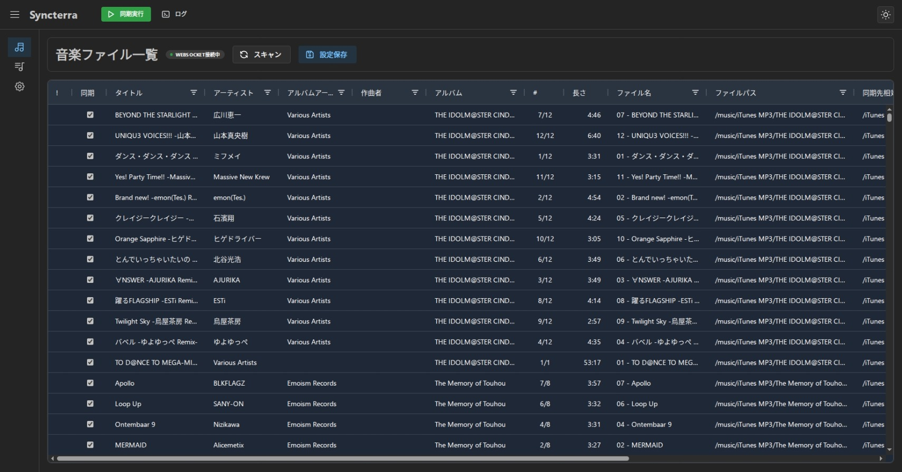
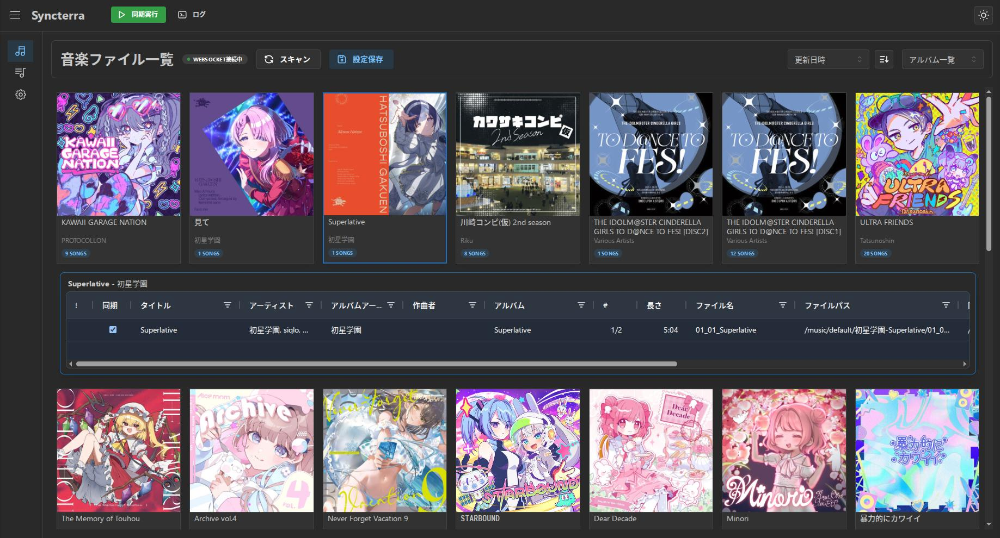
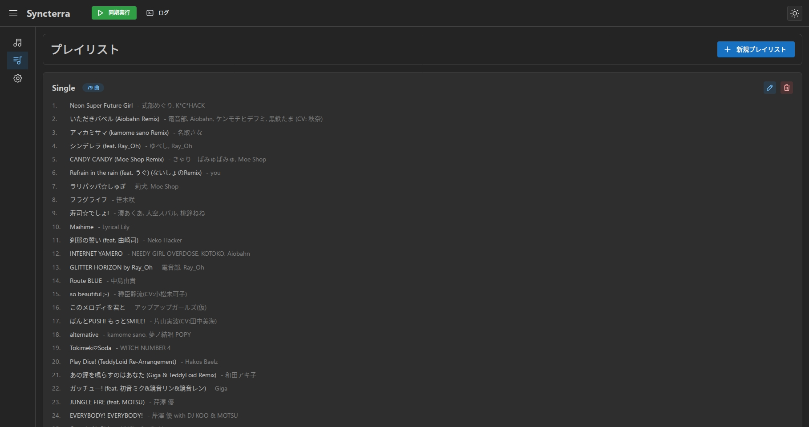
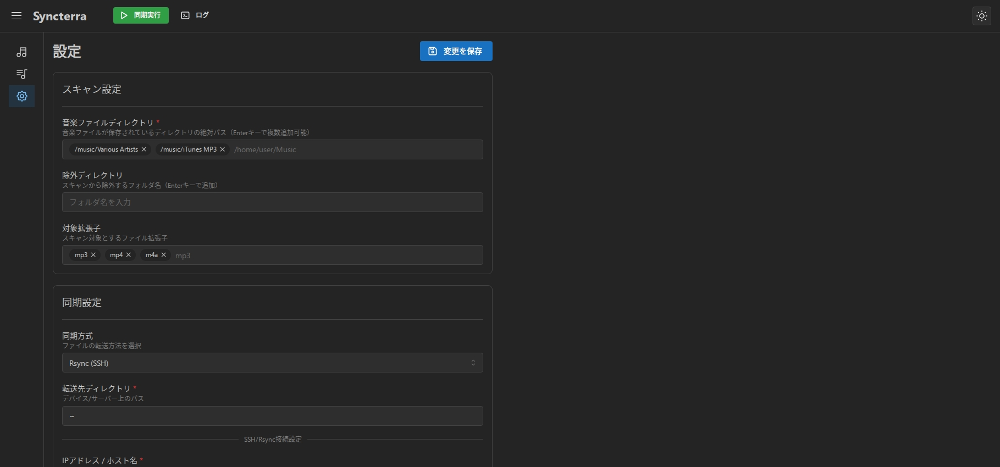
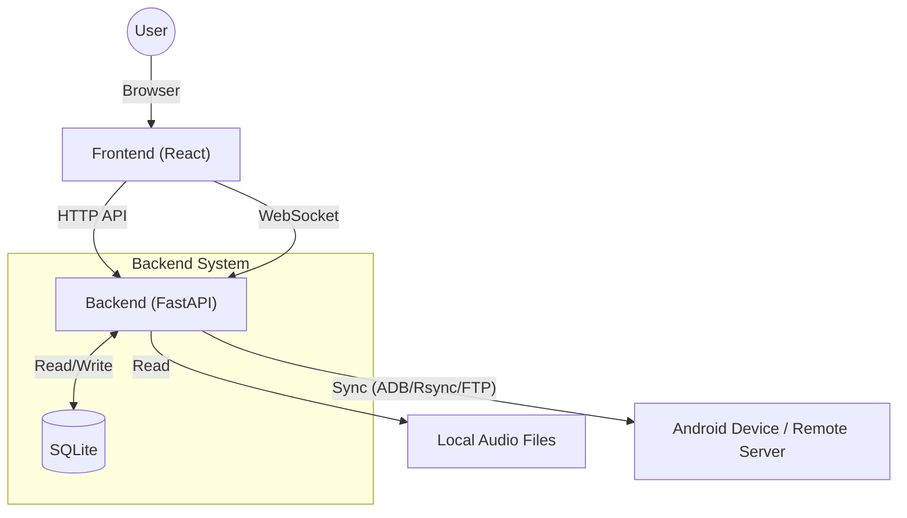

English | [日本語](./README.md)

# Syncterra

Syncterra is a web application designed to synchronize audio files on your PC with your devices.

## Key Features

### Music File Synchronization Management
You can synchronize only selected songs from music files in a specified directory on your PC.

With normal file copying or simple directory synchronization using robocopy/rsync, operations like "synchronizing only a few songs from an album" are not easy to perform. Adding or removing specific songs later is even more troublesome.

Syncterra allows you to set synchronization necessity for each file, mimicking the iTunes synchronization method. This makes it easy to manage synchronization for individual tracks.

### Playlist Management
You can create and edit playlists on Syncterra.

### Synchronization Methods
You can choose from ADB, FTP, or Rsync as the synchronization method.

#### ADB
Transfers music files to an Android device using ADB (Android Debug Bridge). An environment where the machine running Syncterra can connect to the Android device via ADB commands is required.
> [!WARNING]
> The ADB synchronization mode has not been tested and may be unstable.

#### FTP
Transfers music files to the device using FTP (File Transfer Protocol).

Please start an FTP server on the device to be synchronized.

For Android devices, please use an app such as [Ftp Server](https://play.google.com/store/apps/details?id=com.theolivetree.ftpserver&hl=en).

#### Rsync
Transfers music files to the device using Rsync.

Please install Rsync and start an SSH server on the device to be synchronized. However, if the synchronization destination is a local directory, an SSH server is not required.

For Android devices, please use an app such as [Sshd4a](https://github.com/tfonteyn/Sshd4a).

## Screenshots






## System Architecture



It is a web-based architecture.

- **Frontend**: React (Vite), AG Grid, etc
- **Backend**: Python + FastAPI
- **Data Management**: Settings, playlists, and track management information are all stored in SQLite.
- **Core Engine**: Implements a synchronization engine (`AudioSynchronizer`) that abstracts the three protocols `ADB`, `Rsync`, and `FTP`, enabling support for flexible device environments.

## Prerequisites

- **Runtime**:
    - Python 3.8+
    - Node.js (v18+ recommended)
    - ADB (Android Debug Bridge) - If using ADB sync mode
- **Tools**:
    - [uv](https://github.com/astral-sh/uv) (Python package management)
    - npm (Node package management)


## Execution (Without Docker)

### Setup

Install dependencies.

#### Backend

```bash
uv sync
```

#### Frontend

```bash
cd frontend
npm install
```

### Start

#### Backend

```bash
uv run uvicorn backend.main:app --reload
```

#### Frontend

Run in a separate terminal.

```bash
cd frontend
npm run dev
```

### Accessing the Application

Please access `http://localhost:5173` in your browser.
API requests are automatically forwarded to the backend by the frontend proxy settings.

## **(Recommended)** Execution with Docker

You can use Docker Compose to start the application without setup.
Please copy `docker-compose.sample.yml` to create `docker-compose.yml`.

#### Start

```bash
docker-compose -f docker/docker-compose.yml up --build -d
```


## Execution (Desktop App)

The Electron version of the desktop app has been released.
Run the AppImage file posted in the Release.
Configuration files are saved under `~/.config/Syncterra/`.


#### Accessing the Application

*   **Web UI**: `http://localhost:8280`
*   **API Docs**: `http://localhost:8280/api/docs`

#### Notes

*   **Music Folder**: By default, the host's `~/Music` is mounted as `/music/default`. To change this, please edit the `volumes` section of `docker/docker-compose.yml`.
*   **Database**: The SQLite database is persisted in the `db/` directory.
*   **ADB Sync**: When synchronizing an Android device, you need to enable `network_mode: "host"` in `docker-compose.yml`.

## Software Used

- **Backend**: Python, FastAPI, SQLAlchemy (SQLite), aiosqlite, Websockets
- **Frontend**: TypeScript, React, Vite, Mantine UI, AG Grid
- **Others**: Mutagen (Audio Metadata), Adbutils

## License

This software is released under the **GPL v3 (GNU General Public License v3)**.
Please see the [LICENSE](./LICENSE) file for details.
Since it uses GPL libraries such as `mutagen` (GPL v2+), if you distribute derivatives of this software, you must adopt a GPL-compatible license.
